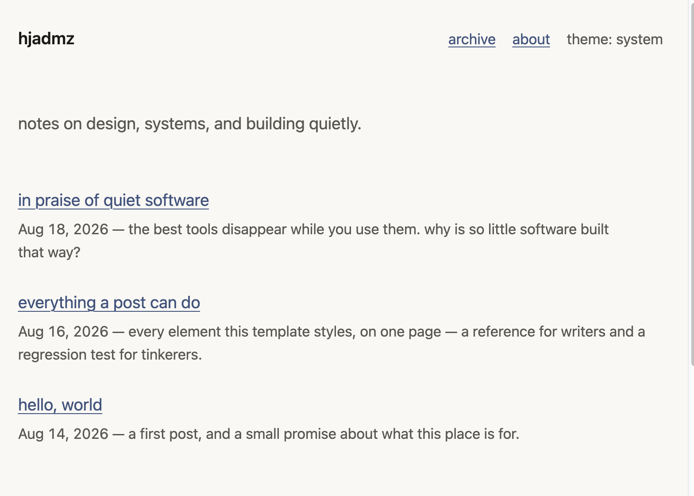
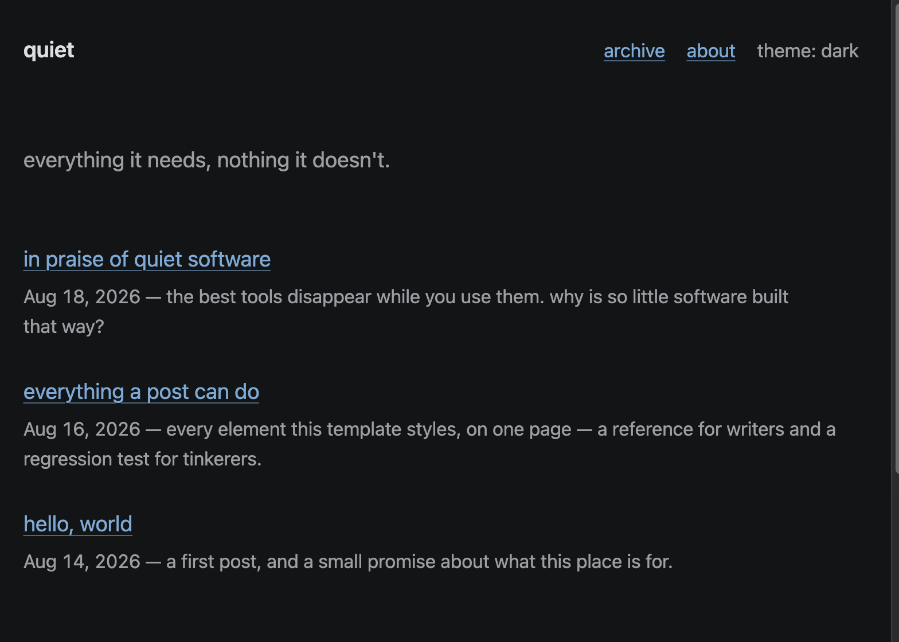

# quiet

A reading-first Jekyll blog template for GitHub Pages and static hosts.
[See the live demo](https://quiet.hjadmz.com).

**The philosophy in three sentences.** Function first, then convenience,
then aesthetics. The reader outranks the writer, and the writer outranks
the customizer. If the interface pulls attention away from reading, it has
failed; if its details make reading feel effortless, it has succeeded.

| light | dark |
|-------|------|
|  |  |

## quickstart

1. Click **Use this template** and name the new repo `username.github.io`,
   using your GitHub username. If you fork instead, rename the fork afterward.
2. In the repo settings, under **Pages**, make sure the source is
   "Deploy from a branch" with the `main` branch selected and `/ (root)`
   as the publishing folder.
3. Edit `_config.yml` — every user-facing setting is explained. Set at least `title`,
   `author.name`, and `url`.
4. Delete the three demo posts in `_posts/`, and rewrite `about.md`
   in your own words.
5. Write Markdown files in `_posts/` named `YYYY-MM-DD-your-title.md`.

You can skip manual file naming with:

```bash
npm run blog:new -- "My post title"
```

This writes `YYYY-MM-DD-my-post-title.md` with `published: false`. After you finish writing, open your preferred editor and switch it to `published: true`.

GitHub Pages rebuilds after each push to `main`; the exact wait varies.
The hosted path requires no local build tools. Local preview and the
maintainer checks use the pinned Ruby and Node dependencies in this repo.

## writing posts

Create a new post file with `npm run blog:new -- "My first post"` and then edit it:

```markdown
---
title: my first post
description: one honest sentence about what this post is.
---

Text goes here. Markdown in, blog out.
```

Front matter reference:

| key           | required | effect |
|---------------|----------|--------|
| `title`       | yes      | the post's title |
| `description` | by convention | one line under the title on the home page, and the post's search/social description |
| `toc`         | no       | `toc: true` renders a table of contents from the post's h2/h3 headings |
| `last_modified_at` | no  | `last_modified_at: 2026-09-01` shows an "updated" date and updates the feed, sitemap, and page metadata |
| `image`       | no       | path to a social-preview image for this post, overriding the site default |

### heading anchors and TOC behavior

`quiet` generates both TOC and heading anchors at build time from real rendered headings:

- `toc: true` builds a TOC from **h2 and h3 headings only**.
- h2–h4 headings receive a small `#` permalink link (the blue hash in your browser); it lets readers jump to direct URLs for that heading.
- No JavaScript is used for these links; they are part of the generated HTML.
- If you want a cleaner look, remove heading hashes by changing `.anchor` in `assets/css/main.css` (for example, `display: none;` or a neutral color).

This is intentional: subtitles in `##`/`###` form are included for article navigation, while deep h4 headings stay out of the TOC to avoid an overly busy map.

Files in `_drafts/` (no date in the filename) are not rendered by a normal
build. They are still visible if committed to a public repository, so never
put secrets or genuinely private writing there. Preview them with
`npm run dev`.

## customization

Site-wide settings live in `_config.yml`, and every user-facing setting is
explained in place. Posts, the About page, and image files remain ordinary
content. The short version:

| key | effect |
|-----|--------|
| `title`, `tagline`, `description` | site name and one-line bio |
| `author.name` | feed and metadata attribution |
| `url`, `baseurl` | your address; `baseurl: /repo` for project sites |
| `lang` | html language code |
| `accent`, `accent_dark` | the one accent color (links, focus, selection, targeted footnotes) |
| `body_font` | `sans` or `serif` — both system stacks |
| `theme_default` | `system`, `light`, or `dark` |
| `posts_on_home` | how many posts the home page lists |
| `date_format` | strftime format for dates on posts and the home list |
| `timezone` | IANA timezone for post dates and feed timestamps |
| `show_reading_time` | the "· 6 min read" meta |
| `show_credit` | the "built with quiet" footer line |
| `footer.github`, `footer.email` | footer links; hidden when empty |
| `favicon`, `apple_touch_icon` | icon paths |
| `analytics_html` | empty by default; see recipes |

The default social-preview image is the file at
`assets/img/og-default.png` — replace it with your own (1200×630), or
point the `image:` path in the config's `defaults:` block somewhere else.

### changing the accent

Set `accent` in `_config.yml` to any valid CSS color. Pick something that
keeps at least 4.5:1 contrast against both backgrounds (`#faf8f5` light,
`#121416` dark), or set `accent_dark` for a separate dark-mode value —
lighter and slightly desaturated usually works.

### changing the type

`body_font: serif` switches the body to a system serif stack (Charter /
Iowan Old Style / Georgia). Deeper changes live at the top of
`assets/css/main.css`: sizes, spacing, fonts, and radius in the first
`:root` block; colors in the OKLCH `@supports` blocks just below it
(the adjacent hex values are fallbacks for old browsers — keep them
in sync, once per theme).

## custom domain

For GitHub Pages, add a `CNAME` file containing your domain (for example,
`blog.example.com`), point DNS at GitHub Pages per
[GitHub's guide](https://docs.github.com/en/pages/configuring-a-custom-domain-for-your-github-pages-site),
and update `url` in `_config.yml`.

For Cloudflare Pages, connect the custom domain in the Pages dashboard;
do not add a GitHub Pages `CNAME` file. In either case, choose one canonical
hostname and set `url` to it. If you want this running at `blog.hjadmz.com`,
set both `url` values to that host and map that subdomain in Pages/DNS.

## hosting somewhere else

The repository uses GitHub Pages' pinned Jekyll dependency set, but the
generated HTML, CSS, JavaScript, XML, and assets are host-independent:

- **Cloudflare Pages** — replace `_config.cloudflare.yml` with your own URL
  and identity; clear or rewrite its `description`, `demo_notice`, and footer,
  while keeping `include: ["_headers"]`. Connect the repo, set the
  production branch to `main`, build command to `npm run verify:cloudflare`,
  and output directory to `_site`. Set `RUBY_VERSION=3.3.12`,
  `JEKYLL_ENV=production`, and `BUNDLE_FROZEN=true` in production and previews.
  Branch pushes then deploy automatically.
- **Netlify or another static host** — run `npm run build` and publish
  `_site`. That generic build emits no host-specific response policy; add a
  host-native header configuration separately if you need one.
- **Any static host, or your own server** — run `bundle exec jekyll build`
  and upload the `_site` folder.
- **Served from a subfolder** (e.g. `example.com/blog`) — set
  `baseurl: "/blog"`. Template URLs use baseurl-aware filters, so no code
  changes are needed. CI includes this build mode.

`_config.cloudflare.yml` contains only the settings for the public
`quiet.hjadmz.com` demo. A fork should delete it or replace it with its own
overlay; it is not loaded by a normal build. The public demo's Pages project
must use `npm run verify:demo` so deployment validates that overlay and the
sample-content disclosure.

## local preview

You usually don't need a local preview. When you want one:

- **Codespaces (no local install):** open the repo in a GitHub Codespace. The
  included devcontainer installs the Ruby and Node dependencies and starts the
  preview on port 4000 automatically.
- **Local:** use Ruby 3.3.12 and Node 22. If needed, install the pinned
  Bundler with `gem install bundler -v 2.6.9`; then run
  `bundle _2.6.9_ install`, `npm ci`, and `npm run dev`. Open
  `http://localhost:4000`.

Before the first browser-matrix run on a machine or Codespace, install its
binaries once with `npx playwright install chromium firefox webkit` (on a
minimal Linux image, use `npx playwright install --with-deps`).

Before publishing template changes, run `npm run verify`,
`npm run test:portable`, and `npm run test:compat`. They validate the actual
site, simulate a customized fork with its demo content removed, and exercise
a controlled browser fixture in Chromium, Firefox, and WebKit (including
no-JavaScript, keyboard, print, responsive, and axe checks). That separation
means deleting the demos or changing supported config values does not make a
fork's test suite fail for the wrong reason.

Maintainers can regenerate the two README images from the current demo build
with `npm run docs:screenshots`; it does not require a local web server.

## recipes

The template itself ships with zero third-party runtime requests—no fonts,
analytics, or trackers. Host-level security products can still inject code.
The Cloudflare overlay sends `no-transform`, which [Cloudflare documents](https://developers.cloudflare.com/cloudflare-challenges/challenge-types/javascript-detections/)
as disabling JavaScript Detections injection on matched responses. If you add
third-party services, reassess privacy and consent needs:

- **Analytics** — leave it off unless a concrete question justifies the
  collection. If it does, put the provider snippet in `analytics_html`.
  Generated-HTML checks allow external runtime there explicitly. Outside it,
  external `src` URLs on script, iframe, img, source, video, and audio elements,
  plus external stylesheet, icon, and preload links, fail the build.
- **A custom font** — put the `.woff2` in `assets/`, add an
  `@font-face` rule at the top of `assets/css/main.css`, and change
  `--font-sans`. Self-host; never a font CDN.

## why it's built this way

Decisions follow an evidence hierarchy: accessibility requirements and
measured behavior first, the reading task second, and named design heuristics
only as lenses. Rams's principles, Benji Taylor's emphasis on simplicity and
continuity, Nielsen's heuristics, and familiar perception principles inform
the work; none is treated as automatic proof.
[docs/DESIGN-PRINCIPLES.md](docs/DESIGN-PRINCIPLES.md) records the
reasoning, sources, measured numbers, and refusals.
[docs/ACCEPTANCE.md](docs/ACCEPTANCE.md) records the current retained test
matrix and separates automated evidence from older point-in-time audits.

## license

[MIT](LICENSE). Use it, change it, sell things built with it. The
"built with quiet" footer credit is one config key to remove —
guilt-free. The small feed-template derivation is covered in
[THIRD_PARTY_NOTICES.md](THIRD_PARTY_NOTICES.md).
